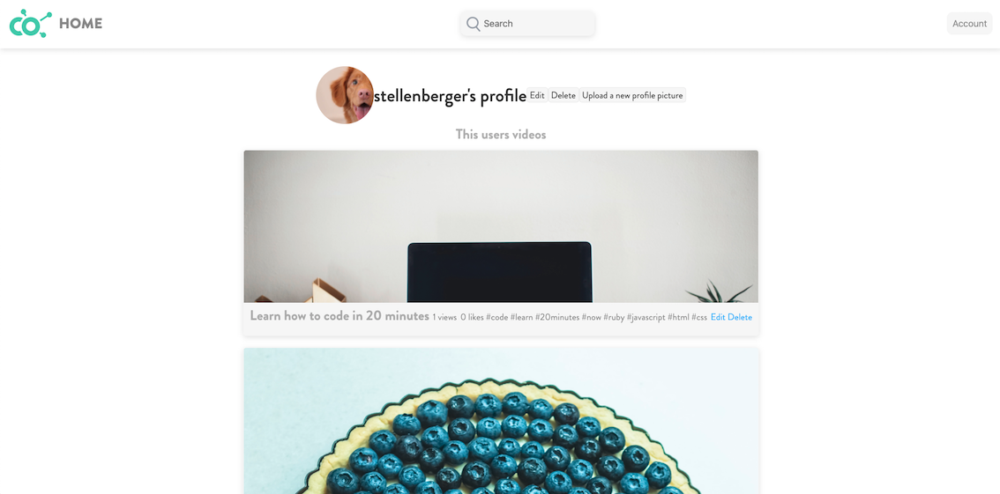
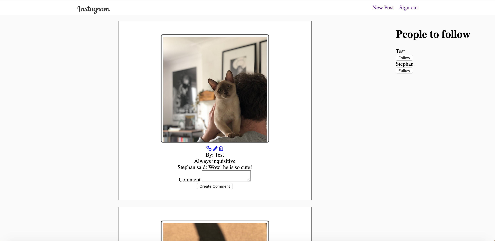
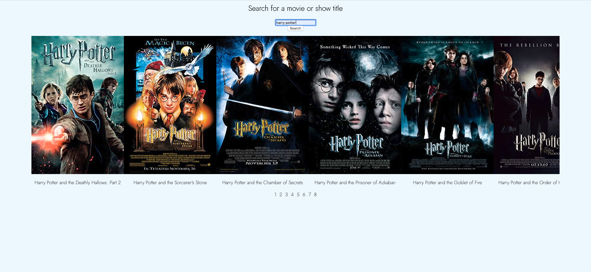
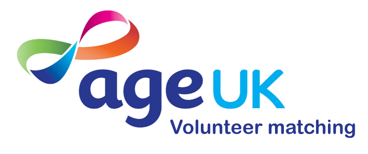

<h1 align="center">Stephan Ellenberger</h1>

    

[Skills ](#skills) | [Projects ](#projects) | [Education ](#education) | [Experience ](#experience) | [Interests ](#interests)

Concert pianist turned Junior Developer, I am a recent graduate of Makers Academy May 2020. Inquisitive to all things tech and music, I pride myself in attention to detail and my desire to explore new technologies. I strive to build a career in Software Development, where I am challenged daily with strategical thinking at the forefront of the evolving technological world.

## Skills

#### Efficient and Economical
The attention to detail required to perform the thousands of notes in a Beethoven sonata from memory and under pressure has taught me one valuable skill - working methodically. Transferring this skill to programming has played a vital role in my efficiency when it comes to writing complex code; where incorporating strategies such as Test Driven Development or analytical thinking is essential in order to write scalable and structurally secure code.

#### Creative and Inquisitive
My love for analytical thinking and problem solving is what made programming appealing to me. I am a logical thinker and fast learner, an attribute that has been well tested during my time at Makers, and I'm always eager to try new techniques to improve my ability. My prior experience as a musician has taught me to be inquisitive and to try many solutions, as it broadens ones creative scope and encourages an educated output.

#### Communication

During my time at Makers, I was tasked with programming in pairs or teams nearly every day of the course. Communication is crucial to continuous learning as well as being able to summarise problems to find efficient solutions. I am confident in explaining technological concepts with metaphors and non-technical language in order to make it as accessible as possible.

## Projects

| | | 
|:-------------------------:|:-------------------------:|
|   [Community Video](https://github.com/stellenberger/Community-Video) |  Makers Academy final project. Inspired by social distancing regulations in the 2020 Covid outbreak, this project brings communities closer by encouraging users to share skills with other members, and get paid through donations from other users. This project was completed remotely in 7 days.  |
  [Gilded Rose](https://github.com/stellenberger/GildedRose-Refactoring-Kata/tree/master/js-jasmine) \| [Bank Tech Test](https://github.com/stellenberger/bank_tech_test) | Week 10 of Makers Academy, to showcase solo understanding in OOP and TDD. Written in Ruby and Javascript. |
|   [Instagram-challenge](https://github.com/stellenberger/instagram-challenge) | Makers Academy weekend challenge - Instagram clone using rails, with basic features to produce an MVP. Completed in 2 days, solo work. | 
|   [Moovie-Choosie](https://github.com/stellenberger/movie_choosie) | Movie search engine that displays many attributes of chosen movie. Solo project aimed at practising Vanilla JavaScript, using the DOM and creating single page applications with no page reload. | 
|   [Age UK Volunteer Matching](https://github.com/ratcliffetj/Age-UK-Volunteer-Matching) | Completed in just 48 hours as part of a brief submitted by AGE UK for the Hack for Heros Hackathon, June 2020. A team of seven people and created using Ruby on Rails, the app secured the team special mention for second place. The app is now being re-written with React and Rails (can be found <a href="https://github.com/ratcliffetj/Age-UK-Volunteer-Matching">here</a>) for the public. | 
## Education

#### Makers Academy (Jan 2020 - May 2020)

- Competent with programming practises such as OOP, TDD, MVC, DDD
- Efficient work using Agile/XP
- Web development with Ruby, Rails and JavaScript
- Testing frameworks such as RSpec, Jasmine

#### Trinity Laban Conservatoire of Music and Dance (2015 - 2018)

- Classical Performance - Principal Study Piano
- Performed in venues such as Wigmore Hall, Barbican Centre, and St. James' Picadilly.
- Principal Study teachers: Gabriele Baldocci & Philip Fowke (Emeritus Fellow)

#### Emanuel School (2011 - 2013)
- Sixth Form Advance Level Qualifications
- Music, Maths, Design & Technology

#### Other Qualifications

- ATCL Diploma (Piano Performance) (2014)

## Experience

**now-u** (2015 - 2020)    
*Volunteer Back End Developer*  
- Developing a Ruby on Rails API for a React and Flutter front end, managing user authentication, campaigns, donations, blogs comments and more. The application consists of nearly 40 relation tables. 
- Use of Docker for deployment
- Mapped out the entire relation table for documentation in a diagram for use in onboarding and debugging. 

**Self Employed Professional Musician** (2015 - 2020)    
*Concert Pianist*  
- Performed at prestigious venues across London, such as:
  *Wigmore Hall*
  *Barbican Centre*
  *St James Piccadilly*
  *Blackheath Halls*
  *Old Royal Naval College Chapel*

**Peripatetic Teacher** (2015 - 2020)   
*Self-Employed Piano & Music Teacher*  
- Worked as a piano and music teacher in multiple schools around London, teaching students from the age of 12 - 18. Responsibilities included taking instrumental and improvisational classes, one-to-one tutoring, accompanying in school shows and international choir tours and assisting in music-related school work.

*Private Piano Teacher*  
 - Working as a piano teacher for private students of all ages and experiences - the youngest being 5 years old and oldest 80. Organised private concerts and events for students to partake in, as well as creating new, original and engaging resources for students to use.

## Interests

- Cooking! Working with different ingredients from around the world is definitely an expensive hobby to have. I have always been inspired by the food discovered when travelling throughout the world, and I love re-creating it at home for my family and friends.
- Photography. I have always been a keen photographer. As a child, I used to make stop-motion lego movies and put them on YouTube. My claim to fame was a headshot that I took which made it on the front cover of the quarterly Southbank Centre magazine in January 2019!
- Learning Spanish. Slowly but surely I am working my way through the ranks of Duolingo to improve my Spanish and be able able to order some tapas and a caña in Spain on my holidays.
